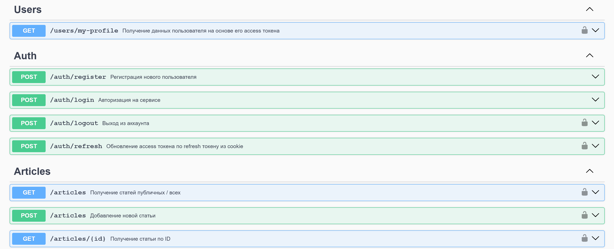

## Тестовое задание️ REST API — NestJS + MySQL + JWT


**Тестовое задание**  
REST API базы со статьями. Получение публичных статей любым пользователем, приватных только авторизованными. Написан на NestJS с использованием MySQL и TypeORM.

Включает в себя:  

- REST API для Аутентификации, Статей, Профиля
- OpenAPI-документация
- Валидация данных через Zod
- Аутентификация по JWT (access + refresh)
- Fingerprint-защита refresh-токенов
- Хранение данных в БД MySQL
- Контейнеризация через Docker, Docker Compose

Использовалось: NestJS, MySQL, TypeORM, JWT, Zod, nestjs-zod, swagger-ui-express, Docker, Docker Compose

## API

#### Документация REST API

- Интерактивный Swagger UI: доступнен по url `OPENAPI_URL>/api` (`<OPENAPI_URL>` берется из `.env`)

## Запуск проекта

1. Клонировать репозиторий
```
git clone https://github.com/ziaq/test-task-article-db-nestjs-mysql-jwt
```
2. Перейти в директорию проекта
```
cd test-task-article-db-nestjs-mysql-jwt
```
3. Создать `.env` файл в корне проекта, скопирвать туда:

```env
NODE_ENV=development

SERVER_HOST=localhost
SERVER_PORT=3002
OPENAPI_URL=http://localhost:3002
CLIENT_URL=http://localhost:5171

DB_HOST=localhost
DB_PORT=3306
DB_USERNAME=app_user
DB_PASSWORD=123456
DB_NAME=article_db

JWT_ACCESS_SECRET=secret_access_token_key_123!@#
JWT_REFRESH_SECRET=even_more_secret_refresh_token_key_456!@#
```
4. Поднять БД MySQL через docker-compose:
```bash
docker-compose up -d
```

5. Собрать проект и применить миграции:
```bash
npm run build
```
```bash
npm run migration:run
```

6. Запустить проект:
```bash
npm start
```

Это поднимет:

- API-сервер NestJS,  доступен по адресу: [`http://localhost:3002`](http://localhost:3002)
- Документация Swagger UI [`http://localhost:3002/api`](http://localhost:3002/api)
- MySQL — база данных

Логин, пароль, имя базы, а также другие настройки берутся из файла `.env`